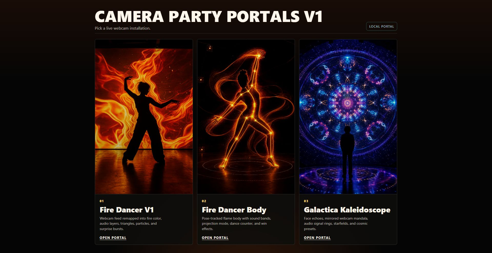

# Camera Party Portals V1

Camera Party Portals V1 is a clean static launcher for three webcam-driven party/projection installations. The public app is rooted at `site/` and opens with a thumbnail picker at `site/index.html`.



Live demo: [borisgiller.com/firedancer](https://borisgiller.com/firedancer/)

## Included Apps

- `site/apps/v1-fire-webcam/` - Fire Dancer V1, the older webcam fire/color-treatment app without body tracking.
- `site/apps/firedancer-body/` - Fire Dancer Body, the latest pose/body-tracking flame silhouette app.
- `site/apps/galactica/` - Galactica Kaleidoscope, the webcam/mic mandala projection app.

The deployable public surface is intentionally small:

```text
site/
  index.html
  launcher.css
assets/readme/
  camera-party-portals-selection-screen.jpg
  apps/
    v1-fire-webcam/
    firedancer-body/
    galactica/
```

## Local Demo

Use a local server for camera and microphone permissions:

```powershell
python -m http.server 8765 -d site
```

Then open:

```text
http://localhost:8765/
```

Direct app paths:

```text
http://localhost:8765/apps/v1-fire-webcam/
http://localhost:8765/apps/firedancer-body/
http://localhost:8765/apps/galactica/
```

## Verification

Package structure test:

```powershell
node --test tests/package-structure.test.mjs
```

Local HTTP smoke from 2026-07-05:

- `http://localhost:8765/` returned `200`.
- App routes returned `200` for all three apps.
- Launcher screenshots were captured at:
  - `output/camera-party-portals-smoke.png`
  - `output/camera-party-portals-localhost.png`

## Cleanup Notes

- Public residuals were removed from the top-level `site/` surface.
- Legacy static tests were moved out of `site/` into `tests/legacy-*`.
- `secrets.env`, deploy scripts, server code, docs, and logs remain outside the public app surface.
- Do not publish `secrets.env` or run deploy helpers without approval.
